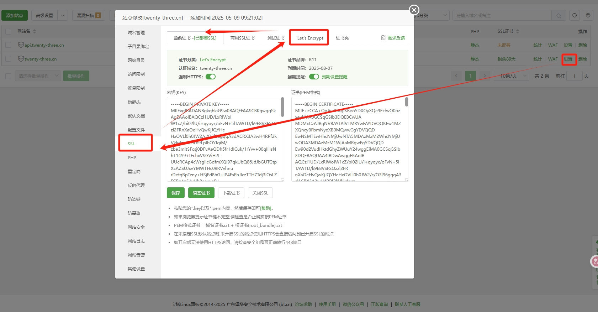
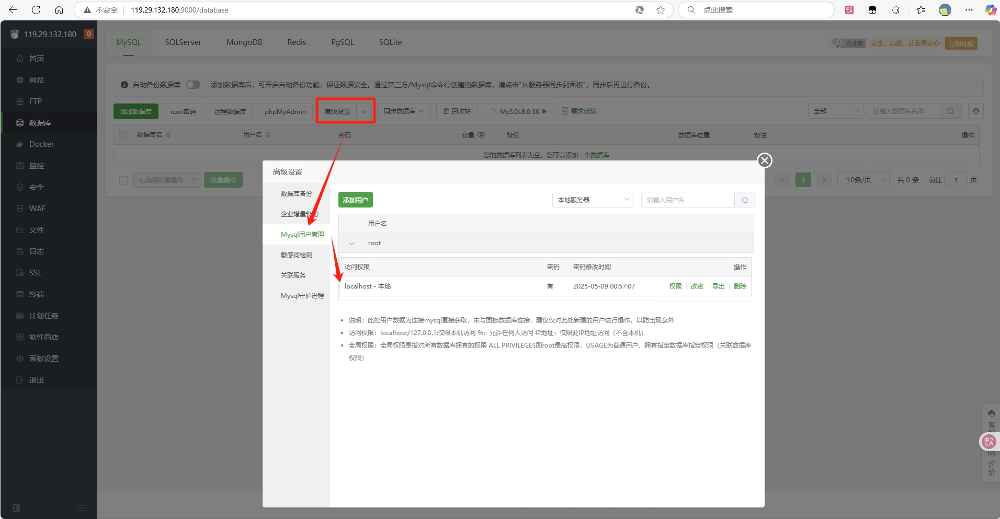

2核2g linux服务器

# 通过 docker 安装 nacos

## 拉镜像

```
docke pull docker.io/nacos/nacos-server:v2.3.2-slim
```

## 创建容器（自动启动）

```
docker run --name nacos --restart=always -e MODE=standalone -e JVM_XMS=128m -e JVM_XMX=128m -e JVM_XMN=64m -e JVM_MS=64m -e JVM_MMS=64m -p 8848:8848 -p 9848:9848 -p 9849:9849 -p 7848:7848 -d nacos/nacos-server:v2.3.2-slim
```

jvm参数再大点都要被系统自动杀掉了，所以要挑小的nacos，配置小的运行参数。

## 查看日志

```
docker logs nacos
```

## 启动容器

```
docker start nacos
```

## 删除容器

```
docker kill nacos
```

## 强制删除镜像

```
docker rmi -f na
```

# 装了宝塔，很方便

装了宝塔后，很多软件能直接在宝塔面板引入，比如docker、nginx、mysql、redis、mq、es。但目前jdk、maven、nacos还是手动引入方便点，看看宝塔后面会不会继续完善生态。

并且通过宝塔配置项目也极为方便，部署Java项目、网页项目，请求代理等，图如下

## java，部署项目

部署Java项目只要把jar包上传到服务器，就可以在面板处添加java项目，找到jar包，就会自动有运行配置。需要将运行用户选为root、运行命令后加--spring.profiles.active=prod，基本就能运行起来了。


## 网页、请求代理

网页运行，就是把打包好的dist上传到服务器，添加静态站点即可。请求代理，一般可以做些反向代理、请求重定向的操作。


此处为了解决https网页不能调用http接口的问题，以及跨域问题等，加了个反向代理。首先把https网页调用的接口域名改为自定义新增的https二级域名，再通过代理监听该二级域名的请求，反向代理到实际接口目标路径。


简单来说：正向代理隐藏真实客户端、反向代理隐藏真实服务端。

**注意，代理到的那个端口要开防火墙，后面踩的坑**

## ssl，申请证书

除此之外，用宝塔配置ssl也极为方便，只要提前做好了域名解析，一级域名，二级域名，只要准备好了。到宝塔面板网站处，把起好的项目配置域名和ssl证书即可。免费90天证书，方便！亲测Let's Encrypt最方便。



## mysql，配置访问

用宝塔可以配置mysql权限，一般root角色只有本地能访问，如果想要配置远程访问，必须得加角色，设置访问IP、访问权限等。

注意：如果Java项目配置上线连接mysql参数时，用root角色或设置了本地访问时，连接ip必须写localhost，亲测写公网IP上线后无法获取mysql连接。


