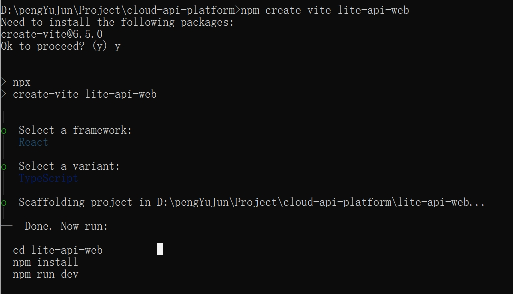

# 一、初始化Vite项目

```
npm create vite 项目名
```

初始化选择过程



# 二、引入antd ui组件

官网：[在 Vite 中使用 - Ant Design](https://ant-design.antgroup.com/docs/react/use-with-vite-cn)

```
npm install antd --save
```

不用加其它配置，下载就能用

# 三、引入路由

```
npm i react-router-dom
```

# 四、配置别名

由于我在写时发现没有path模块，所以得引入path，如果有的话，那就不用引入

```
npm install path --save-dev
```

修改vite.config.ys

```
import { defineConfig } from 'vite'
import react from '@vitejs/plugin-react'
import * as path from "path";

// https://vite.dev/config/
export default defineConfig({
  plugins: [react()],
  resolve: {
    alias: {
      '@': path.resolve(__dirname, 'src')
    }
  }
})
```

修改tsconfig.app.json

```
{
  "compilerOptions": {
    // 省略一堆原配置

    // 别名配置
    "baseUrl": ".",
    "paths": {
      "@/*": ["src/*"]
    }
  },
  "include": ["src"]
}
```

# 五、引入tailwindcss

此处不打算重用，因为是看到有很多用tailwindcss写出来的漂亮组件，比如欢迎页中的介绍卡片。我不想自己重新手撸，所以引入这个技术，直接引用别人写好的卡片。

虽说不打算重用，但以后的事情谁知道呢。

tailwindcss是一个简化样式编写的技术，就是提前把好多样式写好了，你引入它的库，就可以用className调用它的样式，不用自己重新写。

```
npm install tailwindcss @tailwindcss/vite
```

在vite.config中引入

```
import { defineConfig } from 'vite'
import tailwindcss from '@tailwindcss/vite'
export default defineConfig({
  plugins: [
    tailwindcss(),
  ],
})
```

在全局样式index.css中引入

```
@import "tailwindcss";
```


